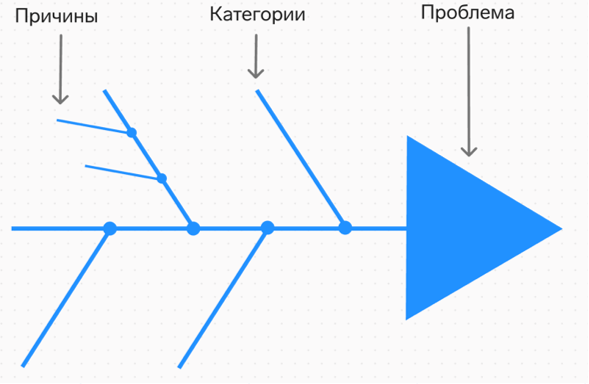

# Качественные методы анализа данных. Диаграма Исикавы: вид анализа, назначение, алгоритм реализации

**Качественные методы анализа данных** — это подходы, используемые для интерпретации нечисловой информации (текста, изображений, видео, мнений) с целью выявления закономерностей, скрытых тем и глубинных смыслов.

---

## Диаграмма Исикавы («Рыбий скелет»)

**Диаграмма Исикавы** — метод визуализации причинно-следственных связей для поиска корня проблемы и её последующего решения.

*   **Определение по ГОСТ:** Диаграмма причин и следствий. Визуальное средство логического структурирования возможных причин проблемы.
*   **Вид анализа:** Структурный, качественный метод причинно-следственного анализа.
*   **Назначение:** Визуализация всех потенциальных причин проблемы для выявления корневых факторов и определения приоритетных действий.

### Алгоритм реализации

#### 1. Определение проблемы
Четко сформулируйте проблему (результат/следствие) и запишите её в «голову» диаграммы в правой части листа. От «головы» проведите влево центральную горизонтальную линию — «хребет рыбы».

#### 2. Выделение основных категорий причин
Определите основные группы факторов, которые могут влиять на проблему. Обычно используют классическую модель «5M» или «6M»:
*   **Man** (Люди/Персонал);
*   **Methods** (Методы/Технологии);
*   **Machines** (Оборудование/Машины);
*   **Materials** (Материалы);
*   **Measurements** (Измерения);
*   **Mother Nature** (Окружающая среда).
Эти категории рисуются как основные «ребра», примыкающие к хребту.

#### 3. Идентификация второстепенных причин
Проведите детальный анализ внутри каждой категории. Выявите конкретные факторы, способствующие возникновению проблемы. Эти причины записываются как ветви, отходящие от соответствующих «ребер» (костей). При необходимости можно углубляться дальше (причины третьего и четвертого порядков).

#### 4. Анализ и ранжирование
После заполнения всей структуры проведите критический анализ всех ветвей. 
*   Выделите наиболее вероятные или критически важные **корневые причины**.
*   Определите факторы, требующие немедленного устранения или дальнейшего детального исследования.

