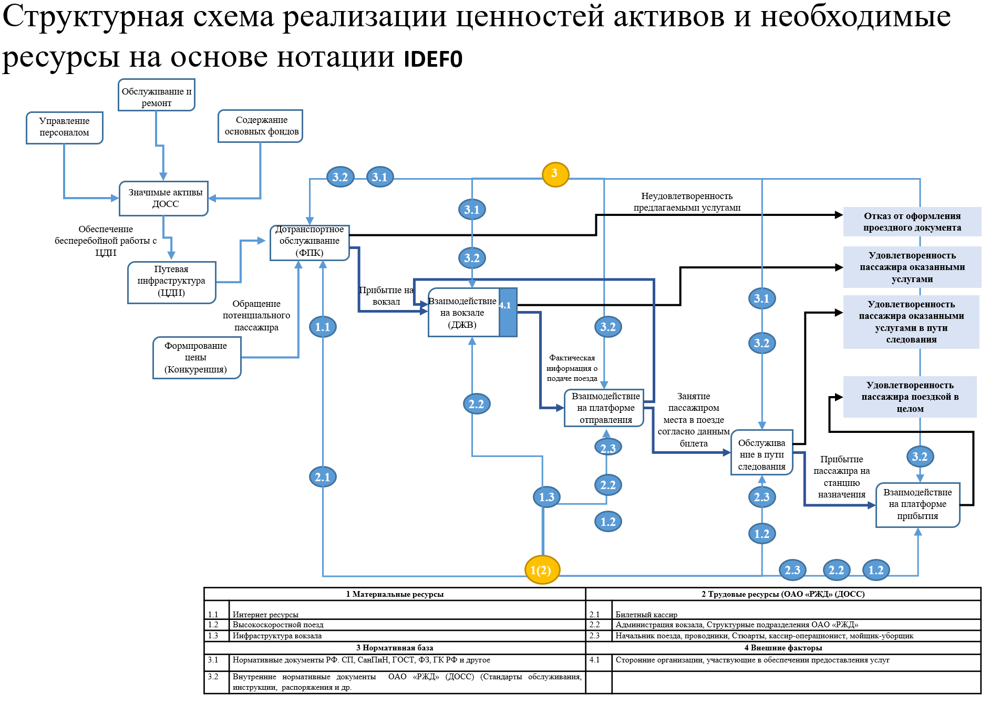
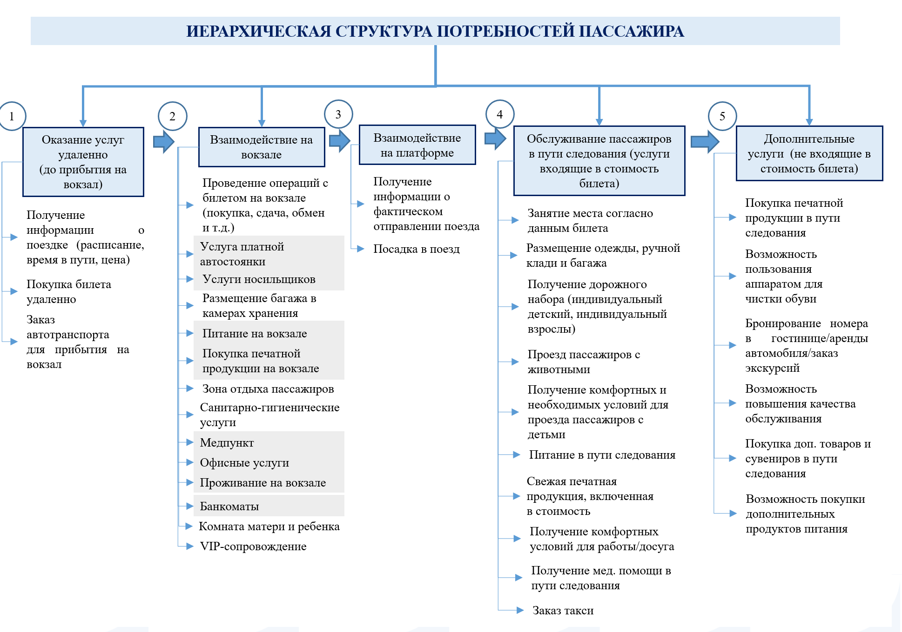

# Данные как основа анализа. Подходы к структуризации информации. Процессный подход нотации IDEF0. Иерархическая структура данных, характеризующих объекты контроля

Данные являются основой для анализа, поскольку предоставляют фактическую информацию, необходимую для понимания текущего состояния, выявления проблем, принятия обоснованных решений и прогнозирования.

## Подходы к структуризации информации

*   **Иерархический подход**: информация организуется по принципу дерева, где элементы подразделяются на уровни (от общего к частному, от целого к частям). *Пример: файловые системы, классификаторы объектов контроля.*
*   **Процессный подход**: информация структурируется вокруг бизнес-процессов, фокусируясь на потоках работ, входах, выходах и ресурсах. Помогает понять, как функционирует организация.
*   **Функциональный подход**: системы и информация разбиваются на отдельные функции или задачи.
*   **Объектно-ориентированный подход**: информация организуется в виде объектов, сочетающих данные (атрибуты) и методы (функции) их обработки.
*   **Реляционный подход**: данные организуются в виде таблиц с определенными связями между собой.

## Процессный подход и нотация IDEF0

**IDEF0 (I-CAM Definition for Functional Modeling)** — это стандарт функционального моделирования, который использует процессный подход для представления деятельности широкого спектра сложных систем.

### Основные элементы
*   **Функция (или операция)**: изображается в виде прямоугольника (блока действий).
*   **Связи (стрелки)**: описывают потоки данных, материалов или информации, входящие в функцию или выходящие из неё. Подразделяются на 4 типа:
    *   **Input (Вход)**: входят в левую сторону блока, преобразуются процессом.
    *   **Control (Управление/Контроль)**: входят в верхнюю часть блока, определяют, как и когда выполняется функция.
    *   **Output (Выход)**: выходят из правой стороны блока, являются результатом выполнения функции.
    *   **Mechanism (Механизм)**: входят в нижнюю часть блока, представляют ресурсы, необходимые для выполнения функции.

**Декомпозиция**: нотация позволяет создавать иерархию диаграмм, детализируя функции до необходимого уровня.

## Иерархическая структура данных

Иерархическая структура данных объектов контроля организует информацию по уровням подчинения.

*   **Принцип**: каждый элемент (объект контроля) на нижнем уровне связан только с одним родительским элементом на верхнем уровне.
*   **Применение**:
    *   **Классификация**: объекты контроля могут быть классифицированы по типам, подтипам, категориям (например: *оборудование -> тип оборудования -> конкретный экземпляр*).
    *   **Территориальное деление**: контролируемые объекты могут быть сгруппированы по странам, регионам, городам, подразделениям.
    *   **Уровни контроля**: от стратегического уровня (контроль всей системы) до оперативного (контроль конкретного элемента или процесса).

